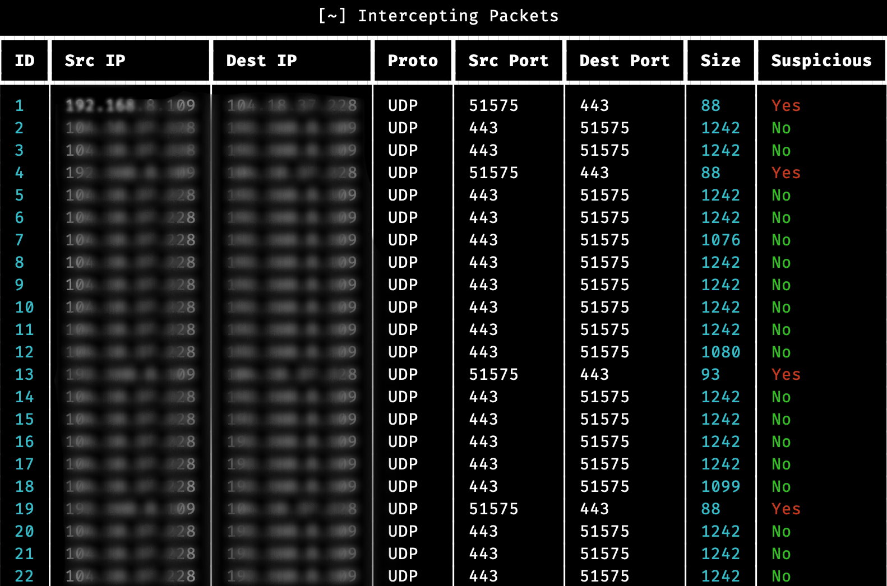

# Network Anomaly Detection Tool
## Table of Contents
- [Overview](#overview)
- [Features](#features)
- [Installation](#installation)
- [Usage](#usage)
- [License](#license)
  
## Overview
This tool is designed for detecting abnormal behaviors in network traffic using the unsupervised Isolation Forest algorithm. It intercepts network packets in real-time, analyzes them, and identifies suspicious activities that deviate from normal patterns.
### ScreenShot


## Features
- Real-time packet interception and analysis
- Detection of abnormal network behaviors
- User-friendly interface for visualization of intercepted packets
- Configurable parameters for fine-tuning the detection algorithm

## Installation
- Clone the repository:
```bash
git clone https://github.com/m-alaiady/Abnormality-Detection-System-for-Network-Traffic.git
```
- Navigate to the project directory
```bash
cd Abnormality-Detection-System-for-Network-Traffic/
```
- Install the required dependencies:
```bash
pip3 install -r requirements.txt
```

## Usage
Run the following command:
```python
sudo python3 main.py
```
**Important:** You need to modify the ```interface``` variable which is located directly after the main function
- Adjust the ```contamination``` parameter in the IsolationForest initialization to control the sensitivity of the anomaly detection algorithm.
Monitor the console output for intercepted packets and their analysis results.


## License
This project is licensed under the MIT License - see the LICENSE file for details.
